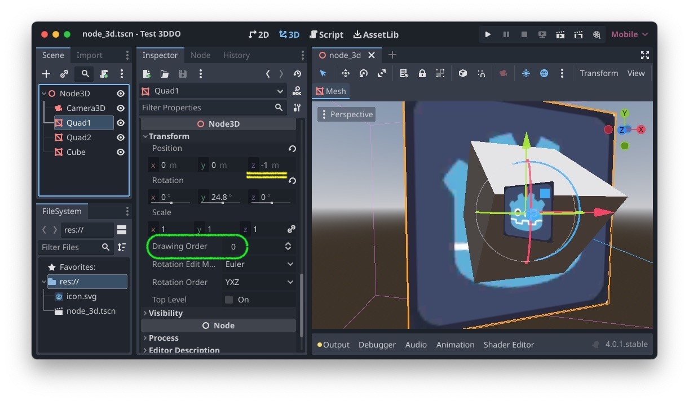
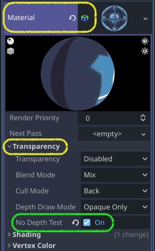

# Godot-3D-Drawing-Order
Godot patch to add a `drawing_order` property to 3D nodes.

About     | Current Release
----------|-----------------------
Version   | 1.0
Date      | July 4, 2023
Platforms | Windows, macOS, Linux
License   | [MIT License](LICENSE)

# Description
- This engine patch adds a `drawing_order` property to `Node3D` and all extended classes. This is similar to the `z_index` for 2D nodes.
- A node's *effective drawing order* is its `drawing_order` plus its parent's effective drawing order. A node with `drawing_order = 2` attached to a top-level node with `drawing_order = 5` will have an effective drawing order of `7`.
- Nodes with a lower effective drawing order are drawn first. If two nodes have the same effective drawing order then the farther node is drawn first (as usual).
- In most cases, nodes utilizing the drawing order mechanism should turn off depth testing (Mesh > Material > Transparency > No Depth Test > On).

- This modification pairs well with the [Mode2DX](https://github.com/brombres/Mode2DX) mechanism for working with 3D scenes using 2D pixel coordinates.

# Installing

This modification requires patching the Godot engine source code and recompiling.

1. Clone or fork the [Godot source code](https://github.com/godotengine/godot). Consider using the [RoGodot](https://github.com/brombres/RoGodot) Rogo-based Godot buildscript to make things easier.
2. Download the appropriate patch file (see below) for the branch you're building. We'll refer to it as `3d-drawing-order-<version>.patch`.
3. [Optional] On the command line, check the patch first with:

        git apply --stat  3d-drawing-order-<version>.patch
        git apply --check 3d-drawing-order-<version>.patch

4. On the command line, execute the following to apply the patch and commit the changes:

        git am -k < 3d-drawing-order-<version>.patch

Patch File  | Description
------------|-----------------------------------------
[3d-drawing-order-4.0.patch](3d-drawing-order-4.0.patch) | Patches the `4.0` branch to add 3D Drawing Order.
[3d-drawing-order-4.1.patch](3d-drawing-order-4.1.patch) | Patches the `4.1` branch\* to add 3D Drawing Order.
[3d-drawing-order-4.0-to-4.1.patch](3d-drawing-order-4.0-to-4.1.patch) | If the `4.0` patch has already been applied, this updates it to be compatible with `4.1`.

\*As of this writing, Godot preview version `4.1-RC1` has been released. The `4.1` patch has only been tested on the `master` branch which should (currently) be equivalent to `4.1`.

# Reference

- Godot 3D Drawing Order development repo: 
  [https://github.com/brombres/godot/tree/feature/3d-drawing-order](https://github.com/brombres/godot/tree/feature/3d-drawing-order)
